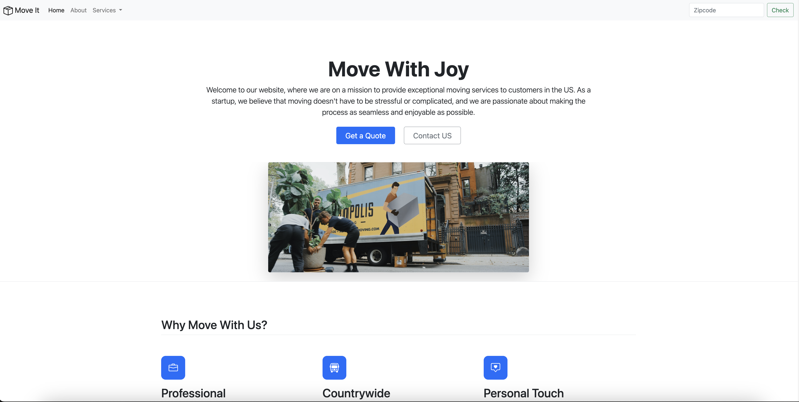

# MovIt - Your Moving Solution 📦

Welcome to MovIt - your ultimate solution for stress-free moving experiences! MovIt is a web platform dedicated to providing exceptional moving services to customers across the United States. Whether you're relocating locally or across the country, we're here to make your move as seamless and enjoyable as possible.



## Table of Contents 
1. About MovIt
2. Features
3. Getting Started
4. Contributing
5. License
6. Project Overview

## About MovIt 💬
MovIt was born out of the belief that moving shouldn't be a stressful or complicated ordeal. As a startup, we're passionate about revolutionizing the moving industry by offering personalized, professional, and countrywide moving services. Our mission is to provide a positive and memorable moving experience for our customers, every step of the way.

## Features 🛠️
- **Professional Service**: Our team of trained movers prioritizes efficiency, organization, and attention to detail to ensure your belongings are handled with care.
- **Countrywide Coverage**: Whether you're moving locally or across the country, we've got you covered with a range of services tailored to your needs.
- **Personal Touch**: We believe in providing a personalized experience, making your move an exciting journey rather than a stressful one.

## Getting Started
To get started with MovIt, simply visit our website and explore our range of services. You can easily request a quote or get in touch with us for more information. Our user-friendly interface makes it easy to navigate and plan your move with confidence.

## Contributing ✨
We welcome contributions from the community to help us improve and expand MovIt's offerings. Whether you're a developer, designer, or have valuable insights to share, we'd love to hear from you. Please see our Contribution Guidelines for more information on how to get involved.

## License 📋
MovIt is licensed under the MIT License. Feel free to use, modify, and distribute our codebase, keeping in mind the license terms.

## Project Overview 🧐
### Technologies Used
- **HTML5**: Used for structuring the web pages and defining their content.
- **CSS3**: Employed for styling and enhancing the visual presentation of the website.
- **Bootstrap 5**: Leveraged for building responsive and mobile-first designs, making the website compatible across various devices and screen sizes.
- **JavaScript (Bootstrap Bundle)**: Utilized for adding interactive elements and enhancing user experience, particularly for the carousel functionality.
- **GitHub**: Hosted the project repository and utilized for version control and collaboration.
- **CDN**: Leveraged Content Delivery Network (CDN) to efficiently deliver Bootstrap and JavaScript libraries, optimizing website performance.

### What I Learned 💡
- **Responsive Web Design**: Explored and implemented responsive design principles using Bootstrap, ensuring the website looks and functions well on different devices and screen sizes.
- **CSS Styling**: Gained experience in customizing CSS styles to achieve a visually appealing and cohesive design throughout the website.
- **Bootstrap Components**: Learned how to integrate and customize various Bootstrap components like navbar, buttons, forms, and carousel to enhance website functionality and aesthetics.
- **JavaScript Integration**: Integrated JavaScript functionality (Bootstrap Bundle) to add dynamic elements such as carousel navigation for engaging user experience.
- **Version Control with Git**: Practiced version control using Git, managing project versions, and collaborating with others on GitHub, facilitating seamless development workflow.
- **Content Delivery Network (CDN)**: Explored the use of CDNs to efficiently deliver libraries and resources, optimizing website loading speed and performance.
- **Documentation and Communication**: Developed skills in writing clear and concise documentation, such as this README, to effectively communicate project details, technologies used, and lessons learned to potential users and collaborators.

- ## for any questions

```
if(haveAnyQuestions){
    let yourName = ".......", question = ".......";
    sendEmailToMe(yourName,question,odedatias8115@gmail.com);
}
```
